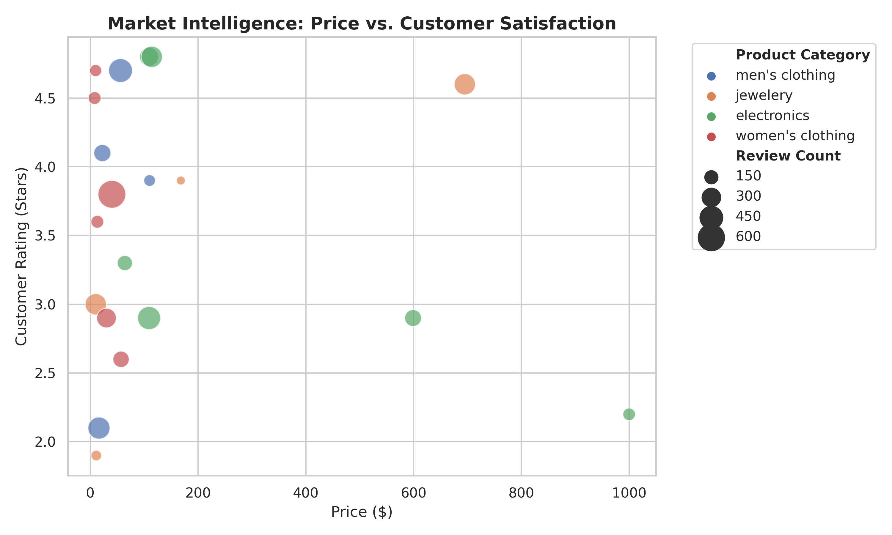
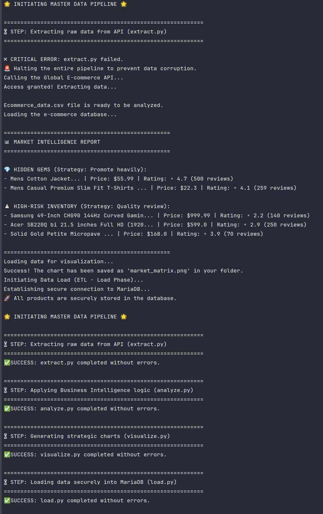

# Global E-commerce Data Pipeline: Market Intelligence

## About This Project
This project is an End-to-End Data Pipeline designed to collect and analyze real e-commerce data using a RESTful API (Fake Store API). By performing rigorous data cleansing and wrangling on the extracted data, this pipeline transforms raw JSON responses into actionable business insights, enabling true market intelligence and trend analysis.

**Note:** The architecture is designed to be highly adaptable, allowing quick pivots between different data sources if API security policies change.

### Technologies Used

  * **Python:** For scripting and API requests.
  * **Pandas:** For data cleaning, structuring, and transformation.
  * **REST API:** As the primary data source (handling JSON responses and status codes).
  * **Git & GitHub:** For version control and portfolio showcase.

### 📈 Business Intelligence & Actionable Insights

Going beyond basic data extraction, this pipeline features an automated **Risk and Investment Matrix** designed to drive strategic business decisions. By analyzing multiple variables simultaneously (Price, Customer Rating, and Review Volume against market medians), the script segments products into actionable categories:

* **💎 Hidden Gems:** High-satisfaction, affordable products with above-average review counts. *(Strategy: Highlight these products and allocate marketing budget to drive volume).*
* **⚠️ High-Risk Inventory:** Expensive items with poor customer ratings. *(Strategy: Flag for quality review with suppliers or consider delisting to protect brand reputation).*

This feature demonstrates the ability to translate raw JSON data into tangible, profit-oriented recommendations.

### 📊 Visual Data Storytelling

**Key Executive Insights:**
* **Core Inventory:** The majority of the catalog focuses on affordable, high-volume items.
* **Marketing Targets:** Identified 4 highly-rated (4.5+ stars), low-cost items (primarily Clothing and Electronics) with massive review volumes. These are prime candidates for customer acquisition campaigns.
* **The "Cash Cow":** A mid-priced Jewelry item shows exceptionally high engagement and satisfaction, acting as a stable revenue generator.
* **Risk Mitigation:** Flagged the most expensive electronic item as a high-risk asset due to poor ratings and low sales velocity, recommending a supplier review.

## 🤖 Orchestration & Automation (ETL)

To ensure data is consistently up-to-date without manual intervention, this project implements a fully automated ETL pipeline.

* **Master Orchestrator (`main.py`):** A Python script utilizing the `subprocess` module to execute the Extract, Transform, Visualize, and Load phases strictly in sequence. It includes built-in fail-safe logic to halt execution and prevent data corruption if any external dependency (like the API) fails.
* **Database Integration:** Securely loads the cleaned, business-ready data into a local **MariaDB** database using `SQLAlchemy`. The architecture respects strict SQL schemas and protects sensitive credentials via environment variables (`.env`).
* **Linux Automation:** The entire pipeline is scheduled using **Arch Linux Cron**, executing silently in the background via a dedicated Anaconda Python environment to manage dependencies efficiently.

*Screenshot: The automated Cron Job successfully executing the master orchestrator and writing to the system log.*

### Future Enhancements
Currently, this project uses Pandas for data transformation, which is the perfect tool for the current volume of data extracted from the API. However, to demonstrate scalability and modern data engineering practices, I plan to migrate the pipeline to the following technologies in the future:

  * **Polars:** To replace Pandas and achieve much faster, multi- threaded data processing.

  * **DuckDB:** To execute rapid analytical SQL queries locally without heavy server installations.

  * **dbt (Data Build Tool):** To manage data transformations directly in SQL, applying software engineering best practices.
